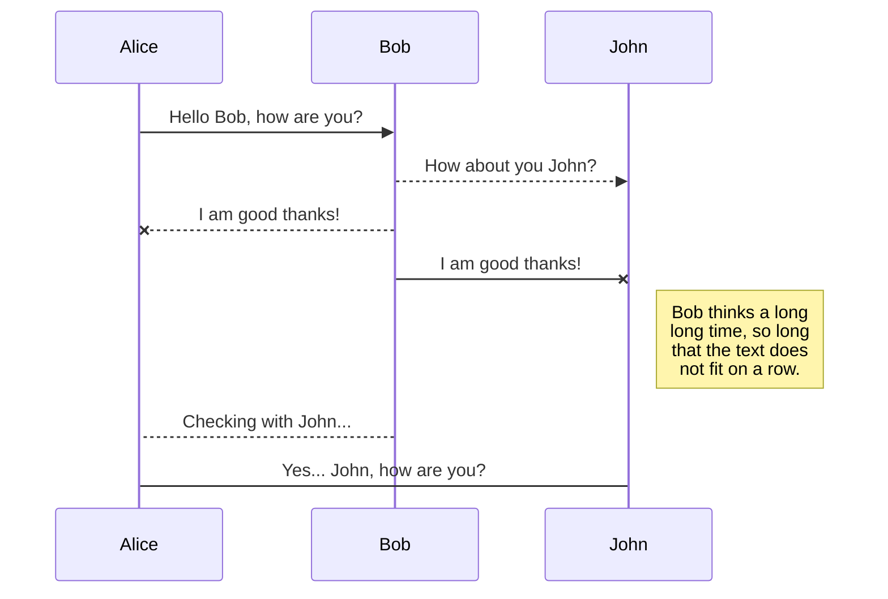
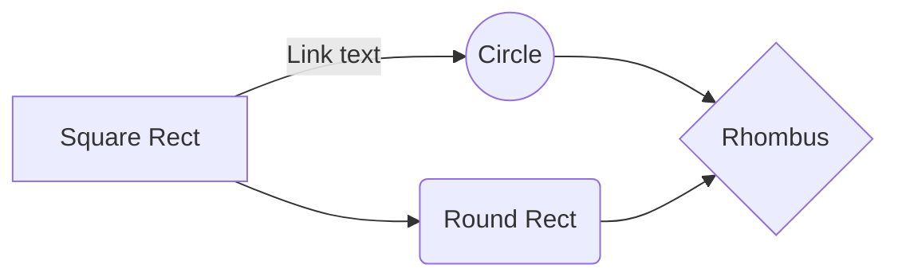

# de-sandbox-k8s
Creation automation for Data Engineering environment meant for development and testing, using **MicroK8s** to deploys services and **multipass** for virtual machine management and creation. 
> ***Note:*** *This project uses vanilla Kubernetes only. Since this tool was made for learning in mind.*

* *Services deployed by default*
 	* **Apache Spark**  <small>Unified analytics engine for large-scale data processing</small>
   * **Debezium**  <small>distributed platform for change data capture</small>
 	* **JupyterHub** <small>Web-server interactive development</small>
	* **Postgres** <small>SQL Database</small>
 	* **Strimzi** <small>distributed event store and stream-processing platform that uses Kafka as base</small>
* *Optional services*
	* **Apache Pulsar**  <small>distributed platform for change data capture</small>
	 * **CockroachDB**  <small>Cloud-native SQL Database</small>
 	 * **Unity Catalog**  <small>Centralized management and governing for data</small>

## To Do

- [ ] **Create Services for deploy**
	- [ ] Apache Spark
	- [ ] Debezium
	- [ ] JupyterHub
	- [ ] Postgres
	- [ ] Strimzi
	- [ ] Unity Catalog
	- [ ] Apache Pulsar
	- [ ] CockroachDB
- [ ] **Create automation scripts**
	- [x] Deploy virtual machines in host target
	- [ ] Configure master node
	- [ ] Configure worker node
- [ ] **CI/CD Pipeline**
	- [ ] Unit tests  
	- [ ] Functional tests
	- [ ] Auto-deployment over SSH

## Deploy project
1. *To deploy, first, to docker compose work properly, you need create a .env inside the root folder*
```bash
```
2. *Done!*  
> ***Tip:*** *If you wish to run even after logout, consider using tmux*
```bash
$ tmux # Starts tmux session
$ tmux list-sessions # List Sessions
$ tmux attach -t {session_name}
# To exit sessions you can ctrl+b d, or juse terminate the SSH session.
```

## Service ports for localhost
| Service    | Fowarded   | Defaults   |   
|------------|------------|------------|
| postgres   | `5432`     | `5432`     |
| JupyterLab | `8888`     | `8888`     |
| pgadmin4   | `5050`     | `80`       |  

# Project Notes
Notes for things that I may find helpful in the future.  
Hopefully I won't need... *~~Not so sure~~*
## Postgres
*Restore postgres backup*
```bash
$ pg_restore -U {POSTGRES_USER} -d dvdrental /var/lib/postgresql/backups/dvdrental.tar
```
*Check database container*
```bash
$ docker exec -it postgres-container sh
root@c97c472db02e:/$ psql -U {USERNAME}
username=#
```
## Debezium
*Serialize the json file with env vars*
```bash
$ jq '.' /debezium/postgres-teste.json | sed -e 's/$POSTGRES_USER/'"$POSTGRES_USER"'/g' -e 's/$POSTGRES_PASSWORD/'"$POSTGRES_PASSWORD"'/g'
```

# Mermaid placeholder. I wanna use this for something cool


And this will produce a flow chart:

